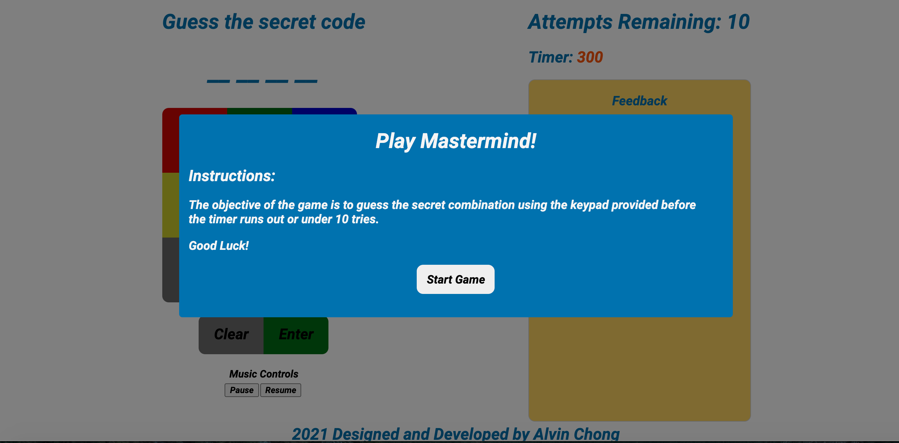
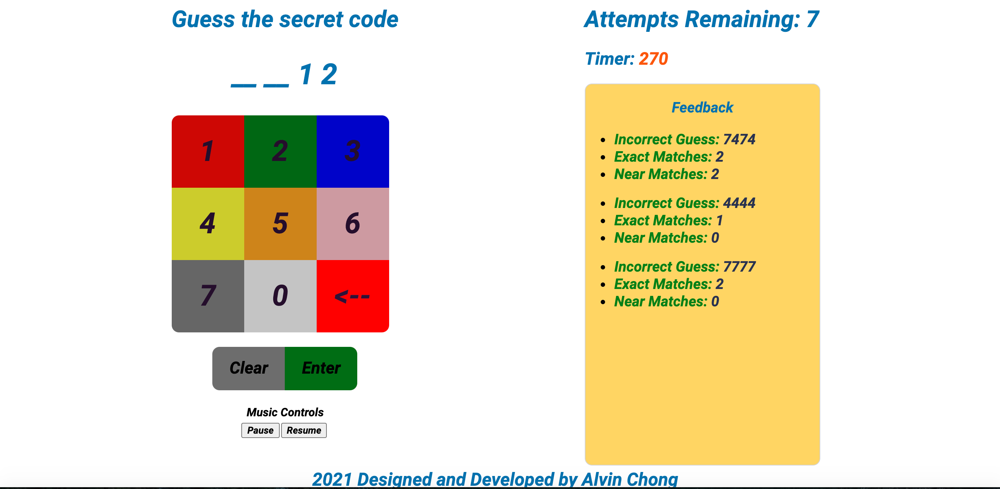
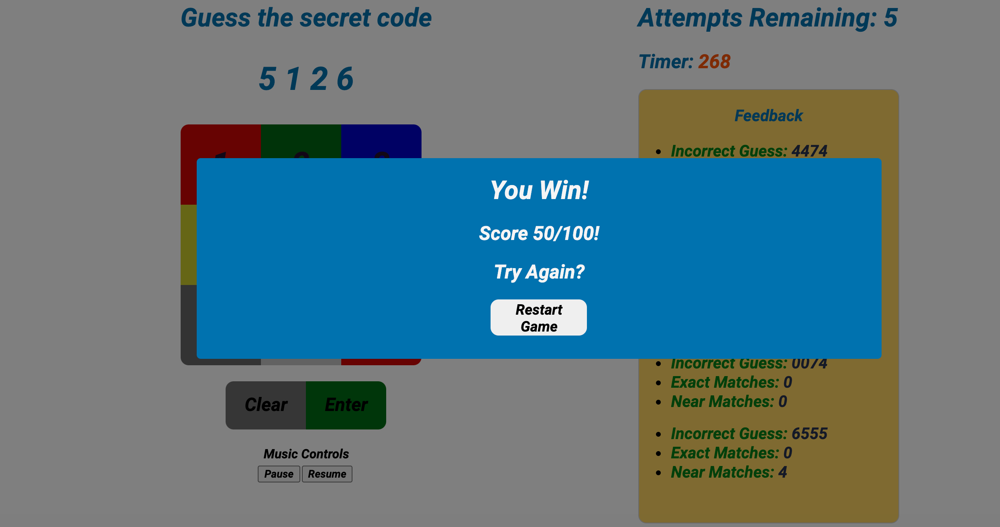

## Description
Mastermind - [live link](https://kaleidoscopic-pavlova-ab630d.netlify.app) is a guessing code game where a User can play against the computer and guess the secret number combinations. At the end of each attempt to guess the 4 number combinations, the computer will provide feedback whether the user had guess a number correctly, or/and a number and digit correctly. A player must guess the right number combinations within 10 attempts to win the game.

## Technologies
* React JS
* HTML
* CSS

## Installation

### Prerequisites
Node.js is required for Mastermind to operate, [click here to install Node.js](https://nodejs.dev/learn/how-to-install-nodejs)

### Setting Up and Running the App
Please run the following:

```
npm install
npm start
```

## Work Breakdown

### April 6th Tuesday
 * Design and Planning - 1/2 Day

### April 7th Wednesday
 * Build out HTLM Layout and User Interface.
 * Implemented core game rules.
 * Programmed computer response with correct number guess, incorrect number guess and correct number but wrong position guess.

### April 8th Thursday
 * Produced the ability to view history of guesses and their feedback.
 * Incorporated Random Number Generator API using React built in Asynchronous function.
 * Started basic CSS styling.

### April 9th Friday
 * Improved overall styling.
 * Introduced audio and sound effects.
 * Implemented score tracker.

### April 10th Saturday
 * Incorporated Timer to the entire game.
 * Finishing touches with CSS styling.


### April 12th Monday
 * ReadMe.
 * Designed and Planning for Difficulty Level and Hints functionality.
 * Finishing Touches.

### April 13th Tuesday
 * Refactor codes to make it DRY.
 * Research on writing test in react.

### April 14th Wednesday
 * Added game difficulty Hard mode
 * Implemented Hints

### April 15th Thursday
 * Refactor codes
 * Finishing touches on CSS styling

## Features
### 1. Start Game Modal
  * Ready to play? Start the game with a click of a button!


### 2. Main game Layout
  * User can use the keypad UI to guess the 4 digit "secret code".
  * User can backspace a code if enter incorrectly or clear all code inputs.
  * Feedback is shown on the right that list the previous code, number of exact matches and number of near matches.
  * Beat the game before the timer runs out or in under 10 attempts. 
  * Music control on bottom left to pause and resume music.


### 3. Game Over Modal
  * Replay the game and beat your previous score!


## Future Considerations
* Writing test unit.
* Incorporate Local Storage to store highscores histories.
* More intricate styling and animations.
